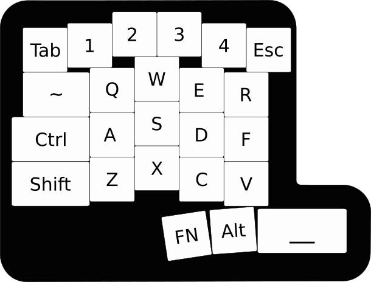

# Game Glove

Having grown tired of trying different keyboard layouts that all always felt slightly off, I set out to design a gaming peripheral that felt right.

## Objectives

### 1. Small footprint

This is a perpipheral that will sit along side my normal keyboard so it should be half the size of a 60% at most.

### 2. Should be able to press the 2 and 3 keys with middle finger

I can't shake this very specific muscle memory, so may as well design around it.

### 3. Row aligned, column staggered, WASD oriented

I've never been able to hit keys like Z, X, and C reliably. My brain refuses to memorize the meat signals to reach down, then laterally. That led me to at least remove the lateral movement by going for something ortholinear-ish.

Pure ortholinear was uncomfortable for me, but column staggered ortho made a lot of sense. The problem is that most column staggered layouts base the spacing off of home-row hand positioning. This is for gaming, so the spacing should be oriented around WASD positioning.

### 4. Modifier keys must be larger than 1u

From trying pure ortholinear, my hands felt fairly cramped with 1u modifier keys.

## V1

After a fair amount of iteration and prototyping, I've landed on the following.

### 4x5 + 4 Layout

I liked the look of 6 keys on row 1 and row 5 felt just right at 3 keys.

### Row staggered first and last row

Row staggering the first row got me my 2/3 key situation I wanted. The last row was positioned based off of where my thumb comfortably sits.

I cannot stress how much time I spent measuring the thumb positioning. It is maddening how many ways there are to do it wrong.

### WASD oriented

I shifted the spacing so that W defines the "peak" of the column staggering.

### Modifier key sizing

I changed the shift to be 1.75u to avoid non-standard sizing issues with keycap sets and then right-justified the modifiers to conform to the row-aligned, column-staggered requirement.
